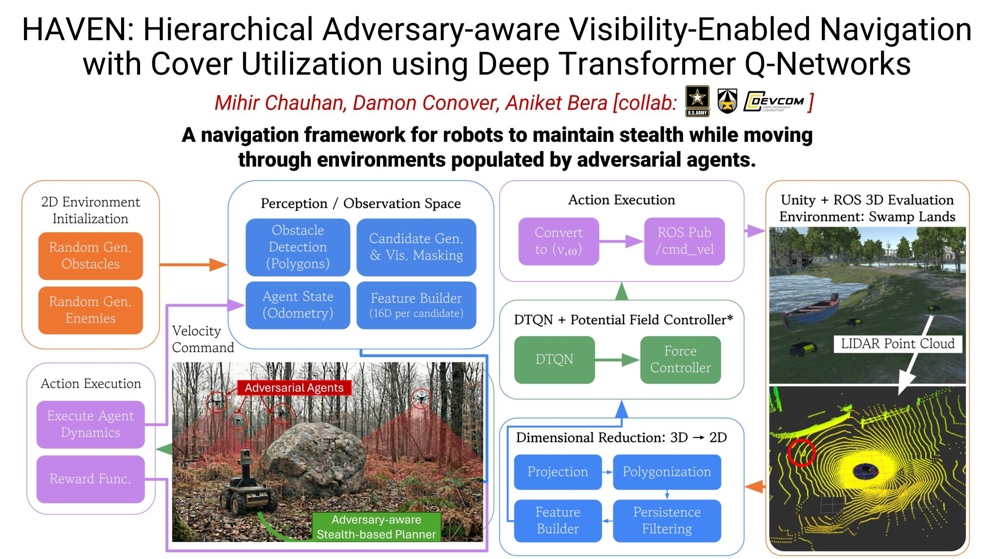

# HAVEN: Hierarchical Adversary-aware Visibility-Enabled Navigation with Cover Utilization using Deep Transformer Q-Networks

[](https://arxiv.org/abs/2512.00592)

**Authors:** [Mihir Chauhan](mailto:chauhanm@purdue.edu)¹, [Damon Conover](mailto:damon.m.conover.civ@army.mil)², [Aniket Bera](mailto:aniketbera@purdue.edu)¹

¹ IDEAS Lab, Department of Computer Science, Purdue University  
² DEVCOM Army Research Laboratory, Adelphi, MD

---

This is the official codebase for **HAVEN** — a hierarchical navigation framework for adversarial, visibility-constrained environments.

## Abstract

Autonomous navigation in partially observable environments requires agents to reason beyond immediate sensor input, exploit occlusion, and ensure safety while progressing toward a goal. These challenges arise in many robotics domains, from urban driving and warehouse automation to defense and surveillance. Classical path planning approaches and memory-less reinforcement learning often fail under limited fields-of-view (FoVs) and occlusions, committing to unsafe or inefficient maneuvers. We propose a hierarchical navigation framework that integrates a Deep Transformer Q-Network (DTQN) as a high-level subgoal selector with a modular low-level controller for waypoint execution. The DTQN consumes short histories of task-aware features, encoding odometry, goal direction, obstacle proximity, and visibility cues, and outputs Q-values to rank candidate subgoals. Visibility-aware candidate generation introduces masking and exposure penalties, rewarding the use of cover and anticipatory safety. A low-level potential field controller then tracks the selected subgoal, ensuring smooth short-horizon obstacle avoidance. We validate our approach in 2D simulation and extend it directly to a 3D Unity–ROS environment by projecting point-cloud perception into the same feature schema, enabling transfer without architectural changes. Results show consistent improvements over classical planners and RL baselines in success rate, safety margins, and time-to-goal, with ablations confirming the value of temporal memory and visibility-aware candidate design. These findings highlight a generalizable framework for safe navigation under uncertainty, with broad relevance across robotic platforms.

---

## Architecture

<p align="center">
  
</p>

**Hierarchical framework.** The high-level DTQN consumes perception and odometry, ranks candidate subgoals via Q-values (with k-step memory), and selects a subgoal. The low-level potential field controller executes trajectories with obstacle avoidance, enemy evasion, and anticipatory safety.

---

## Method Overview

**HAVEN** learns visibility- and adversarial-aware subgoal selection while a deterministic low-level controller handles reactive safety. Our approach directly generalizes from 2D simulation to 3D Unity–ROS by projecting point-cloud perception into the same 16-D feature schema, allowing the trained DTQN to transfer without retraining.

| Component | Description |
|-----------|-------------|
| **High-level (DTQN)** | Transformer-based Q-network with k-step memory; selects subgoals from candidate set |
| **Low-level** | Potential field controller: goal attraction, obstacle repulsion, enemy FoV avoidance, escape behaviors |
| **Candidate generation** | Visibility-aware masking; candidates sampled from obstacle centroids and goal |
| **Features** | 16-D vectors: agent state, goal delta, candidate geometry, enemy visibility stats |

---

## Installation

```bash
pip install -r requirements.txt
```

**Requirements:** Python 3.8+, PyTorch, NumPy, Shapely, Matplotlib, SciPy, scikit-learn

---

## Quick Start

### Train the DTQN (2D simulation)

```bash
python train_dtqn.py 500 --eval-every 25 --save-every 10
```

### Evaluate

```bash
python run_eval_dtqn_hl_ll.py --runs 100 --checkpoint dtqn_checkpoint.pt
```

### 3D / Unity–ROS

Use `main.py` with ROS topics for point-cloud input and `cmd_vel` output. See `main.py` for configuration.

---

## Project Structure

```
fov/
├── train_env.py        # 2D training environment & DTQN policy
├── train_dtqn.py       # Training script
├── sim_core.py         # Simulation core, evaluation, baselines
├── dtqn_model.py       # DTQN architecture
├── main.py             # 3D Unity–ROS integration
├── run_eval_*.py       # Evaluation scripts for each method
├── fig_gen.py          # Regenerate paper figures (→ figs/, then copy to figures/)
├── encomp/             # EnComp baseline (offline RL)
├── figures/            # Paper figures (chauh1–4)
├── figs/               # Generated diagrams
├── assets/             # README images
└── archive/            # Deprecated / legacy code
```

---

## Results

We compare against classical planners (DWA, VFH+), visibility-aware greedy, LSTM baselines, and memory-less HAVEN. Key metrics: **success rate**, **collision rate**, **path length**, **time-to-goal**, **exposure time**.

Results are logged in `eval/*.csv`. Run `run_eval_dtqn_hl_ll.py` to reproduce.

### Demo Videos

Training and evaluation can save episode videos to `train/videos/` and `eval/videos/`. Use `--video 5` with the eval script to record sample runs. Example animations are also available in the repository root (e.g., `animation.mp4`).

---

## Citation

If you use this code or the paper, please cite:

```bibtex
@inproceedings{haven2026,
  title={HAVEN: Hierarchical Adversary-aware Visibility-Enabled Navigation with Cover Utilization using Deep Transformer Q-Networks},
  author={Chauhan, Mihir and Conover, Damon and Bera, Aniket},
  booktitle={IEEE International Conference on Robotics and Automation (ICRA)},
  year={2026}
}
```

